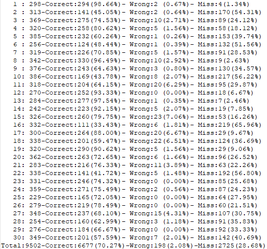
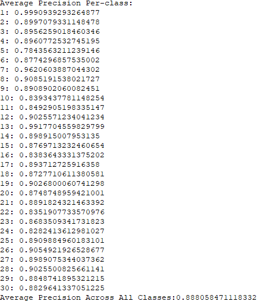

# MobileNetV3-SSD
- 用自己的数据训练一个MobileNetV3，并以此为backbone加入到SSD中训练。


### 第一部分

第一部分MobileNetV3的内容非常简单，大致思路：创建网络，载入预训练模型，fine-tune网络，数据预处理，训练。

- 参考[MobileNetV3](https://github.com/leaderj1001/MobileNetV3-Pytorch)完成网络创建，非常感谢。MobileNetV3有两种网络结构LARGE和SMALL，我选择了SMALL来进行实验，载入预训练的模型之后只需要更具自己数据的类别数量修改最后一层网络即可。

- 数据预处理也是常规的简单处理：

  ```python
  normalize = torchvision.transforms.Normalize(mean=[0.485, 0.456, 0.406],
                                       std=[0.229, 0.224, 0.225])
  train_loader = torch.utils.data.DataLoader(
      torchvision.datasets.ImageFolder(traindir, torchvision.transforms.Compose([
      torchvision.transforms.Resize(input_size),
      torchvision.transforms.RandomCrop(input_size, padding=4),
      torchvision.transforms.RandomHorizontalFlip(),
      torchvision.transforms.ToTensor(),
      normalize,
  ])),
      batch_size=batch_size,
      shuffle=True,
      num_workers=n_workers,
      pin_memory=True
  )
  
  test_loader = torch.utils.data.DataLoader(
      torchvision.datasets.ImageFolder(testdir, torchvision.transforms.Compose([
      torchvision.transforms.Resize(re_size),
      torchvision.transforms.CenterCrop(input_size),
      torchvision.transforms.ToTensor(),
      normalize,
  ])),
      batch_size=batch_size,
      shuffle=False,
      num_workers=n_workers,
      pin_memory=True
  )
  ```


### 第二部分

- SSD的部分大致思路：将MobileNetV3作为backbone放入到SSD中，因为MobileNetV3刚出来不久，这部分的内容需要自己编写，但是SSD和MobileNetV3的工作已经完成度很好了，所以也没有太大难度，参考[SSD](<https://github.com/qfgaohao/pytorch-ssd>)完成，非常感谢。需要注意的一点是在backbone中选取的第一层特征图位置在我的MobileNetV3中第9个MobileBlock中第一个conv中的经过h-swish激活之后的位置即可，这个的选择依据是每层的特征图大小，当然论文中也有提及，变化趋势是19-10-5-3-2-1。我贴出了一个

  > “For MobileNetV3-Small, C4 is the expansion layer of the 9-th bottleneck block.”

  至此便可以开始训练网络，正在训练过程中，之后有了结果我会展示出来，代码我先上传SSD网络的部分，全部内容等之后整理好再一齐上传。

  ##### 补充：

  之前完成了MobileNet V3 Small SSD 的构建，为了尝试有更好的效果，之后也完成了MobileNet V3 Large SSD 的构建，将MobileNet放入SSD中时同样在相应的网络层做处理，使用不同的命名来调用选择使用两种网络。[train_ssd](train_ssd.py)实现SSD网络的训练，为了训练方便我将训练指令写成一个脚本[train_instruct](train_instruct.sh)直接运行即可。同时，[run_ssd_live_demo](run_ssd_live_demo.py)和[eval_ssd](eval_ssd.py)可用于验证和测试训练好的网络效果，此外针对连接摄像头之后的实时检测，在[camera_test](camera_test)中有相应指令可运行。

- 训练需要使用VOC2007样式的数据进行训练，关于制作数据集的内容简单记录一下。


    这里主要需要创建三个文件夹来存放需要的数据：

  1. /Annotations/ 用于存放带有图像信息的xml格式文件。该文件夹中的xml文件主要记录了图像中目标的信息，使用[labelImg](labelImg.exe)工具对图像进行标注便会生成相应的xml文件，操作很简单。其实这里只要能提供图像中目标的坐标信息和类别信息就可以，只是使用xml文件这样的方式比较方便一些。
  2. /ImageSets/Main/ 用于存放带有图像名称索引的txt格式文件。需要对所有数据进行划分分别用于训练，验证和测试，所以需要四个文件trainval.txt，train.txt，val.txt和test.txt来记录每个部分都有哪些图像，txt文件中每一行保存一个图像文件的名称（不带后缀）即可。
  3. /JPEGImages/ 用于存放图像。

  完成这三个文件夹内容的生成便可以丢给网络开始训练了。

### 训练结果

用于训练的数据有30类，数据量大概在95k左右，trainval_proportion和train_proportion都是0.9。

第一部分的训练MobileNetV3-SMALL模型，每个EPOCH的训练时间在10min左右(GTX1070)，设置了20EPOCH之内没有收敛则停止训练，所以大概在140个EPOCH之后停止。训练之后在测试中能够达到99.60的准确率。

第二部分训练MobileNetV3-SMALL based SSD模型。这次的训练在进行了40个EPOCH停止，一方面是因为时间消耗太长，1070的算力不足，如果验证模型有效之后可以投入资源放置到服务器进行训练，所以用5类数据先进性训练会比较合理，另一方面为了得到更好的检测效果，希望尝试使用MobileNetV3-LARGE来代替现在使用的MobileNetV3-SMALL来进行训练。训练完成后我对这个MobileNetV3-SMALL based SSD - 40 EPOCH 模型进行了检测，结果如下：



mAP结果如下：



修改了模型之后，开始训练MobileNetV3-LARGE网络，这次训练了200EPOCH，原因是想让这个更深的网络能够充分学习，从结果来看其实在60个EPOCH之后网络几乎已经停止收敛，准确率能够达到99.64，从分类角度来说这和之前的SMALL网络结果达到的效果是近似的。

接下来开始训练MobileNetV3-SMALL based SSD 模型，这次现在1070上用5个类别的数据进行训练，训练数据量为14.7k，测试数据量为1.6k，完成的一个EPOCH大约耗时22分钟。


##### 补充：

1. 由于之后使用的数据集和训练过程不一致，所以在此没有展示出MobileNetV3-SMALL based SSD和MobileNetV3-LARGE based SSD性能效果的直观对比，主观的来看后者的性能（检测效果）更好，相应的要耗费更多训练时长。
2. 由于训练的数据是非公开数据，没有相应的测试数据也无法测试模型，所以没有上传训练好的模型。训练代码已经上传，可以根据需要训练数据，希望能有所帮助。